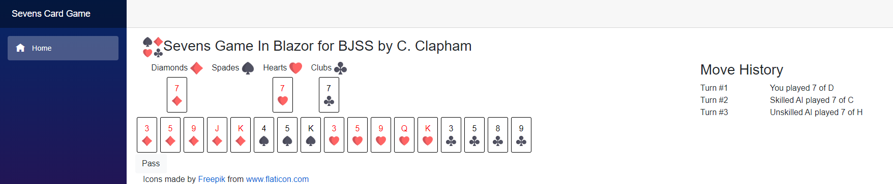

# Sevens-TechTest
Write a game where a single user can play this game against two computer opponents, one computer opponent should play without skill, the other should be more skilful. Include a simple CLI or GUI.

## Notes
* This is an App written in Blazor.
* Unit testing is not complete, this is just edge cases to drive development.
* Missing Unit tesets for the players. Ideally there would be testing on these classes as well, however in order to have a submission for you this has been left out.
